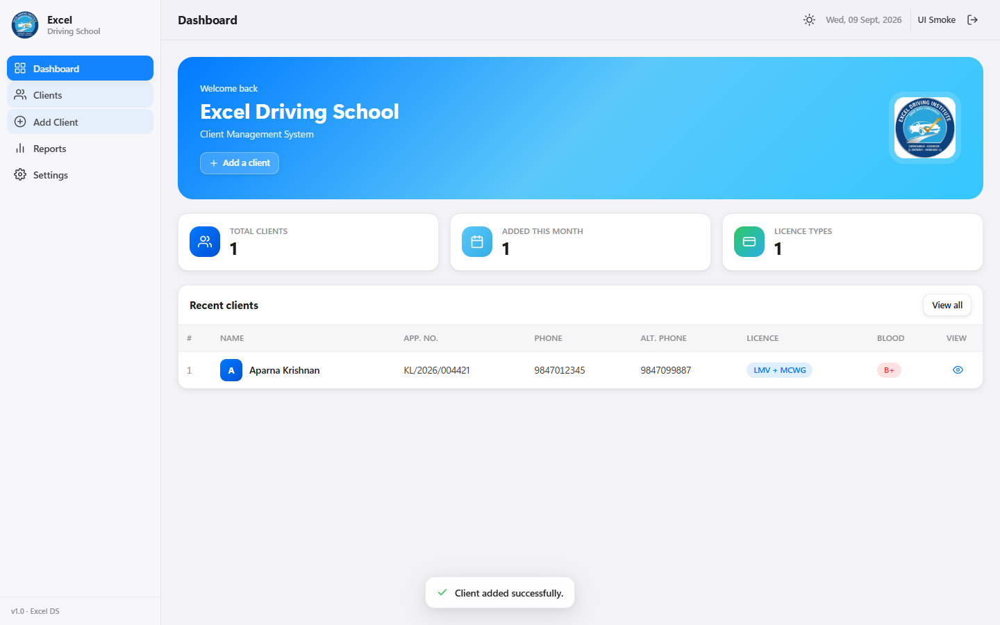

# Excel Driving School — Client Manager

Web app for managing driving-school clients: an Express API over SQLite plus a React front end with a macOS-style interface. Staff sign in from a browser and all of them see the same records.



## What is in here

| Path | Purpose |
|------|---------|
| `server/` | Express API: sessions, clients, payments |
| `web/` | React + TypeScript + Tailwind front end (Vite) |
| `db/clientStore.js` | SQLite data layer (Node's built-in `node:sqlite`) |
| `db/schema.sql` | Readable reference for the schema |
| `scripts/` | Account CLI, backups, benchmarks, smoke tests |
| `docs/APP_SPEC.md` | Authoritative behaviour and design spec |
| `docs/DEPLOYMENT.md` | AWS Lightsail setup, backups and restore runbook |
| `deploy/` | systemd unit, Caddyfile, cron examples, IAM policy |

## Requirements

- **Node.js 22.5 or newer** on both your machine and the server (`node:sqlite` is only available there).
- A modern browser. There is no desktop build; earlier Electron versions are in the git history.

## Running it locally

```bash
npm install          # API dependencies
npm run web:install  # front-end dependencies
```

Create an account (there is no self-signup — the password is prompted for):

```bash
npm run user:add -- --username admin --role admin --name "Front desk"
```

Then run the API and the Vite dev server in two terminals:

```bash
npm run server:dev   # http://127.0.0.1:4000
npm run web:dev      # http://127.0.0.1:5173  (proxies /api to the API)
```

Open <http://127.0.0.1:5173>. To run the way production does — one process serving the built
front end and the API together:

```bash
npm run web:build
npm run server       # http://127.0.0.1:4000
```

## Accounts

| Command | What it does |
|---------|--------------|
| `npm run user:add -- --username NAME --role admin\|staff` | Create an account |
| `npm run user:list` | List accounts and last sign-in |
| `npm run user:passwd -- --username NAME` | Change a password and sign that user out everywhere |
| `npm run user:remove -- --username NAME` | Delete an account |

`staff` can do everything day to day. `admin` is additionally allowed to clear the whole database.

## Configuration

Everything is optional in development; the defaults run out of the box.

| Variable | Default | Meaning |
|----------|---------|---------|
| `PORT` | `4000` | API port |
| `HOST` | `0.0.0.0` | Bind address |
| `EXCEL_DB_PATH` | `./data/clients.sqlite` | SQLite file |
| `EXCEL_WEB_DIST` | `./web/dist` | Built front end to serve |
| `EXCEL_SESSION_DAYS` | `30` | Session cookie lifetime |
| `EXCEL_SECURE_COOKIES` | on when `NODE_ENV=production` | Require HTTPS for the session cookie |
| `EXCEL_TRUST_PROXY` | on when `NODE_ENV=production` | Trust `X-Forwarded-For` from the reverse proxy |
| `EXCEL_LOGIN_ATTEMPTS` | `10` | Sign-in attempts per window, per IP |
| `EXCEL_BACKUP_DIR` | next to the database | Where `backup:now` writes snapshots |
| `EXCEL_S3_TARGET` | unset | `s3://bucket/prefix` for the nightly upload on the server |

## Data and safety

Records live in SQLite with write-ahead logging, which is what lets several people read while
one writes. Every client row carries an `updated_at` stamp: if you save an edit based on a copy
someone else has already changed, the API answers **409** and the form offers to load their
version or knowingly overwrite it, rather than silently discarding their work.

Deleting is handled the same way: if someone removes a client while you are editing it, your
save is refused instead of quietly recreating the record, and you choose whether to restore
it with your changes.

Backups are covered in [`docs/DEPLOYMENT.md`](docs/DEPLOYMENT.md): a nightly `VACUUM INTO`
snapshot uploaded to a versioned S3 bucket, plus weekly instance snapshots. `npm run
backup:now` takes the same snapshot by hand, at any time, while the app is running.
**Settings → Data management** also offers CSV export and JSON backup/restore for local
copies.

## Tests

```bash
npm test                # test:api followed by test:concurrency
npm run test:api        # API, auth, validation and the 409 conflict path
npm run test:concurrency # three signed-in users racing each other, and a backup mid-write
npm run test:ui         # drives the built app in Chrome/Edge and refreshes docs/screenshots
npm run perf            # SQLite benchmark
```

Every suite creates a temporary database and deletes it afterwards, so your real data is
never touched. `test:ui` needs a production build (`npm run web:build`) and a local Chrome or
Edge installation.

## Deploying

See [`docs/DEPLOYMENT.md`](docs/DEPLOYMENT.md) for the full runbook: Lightsail in `ap-south-1`,
Caddy terminating HTTPS, systemd keeping the API alive, firewall rules, backups and restores.
